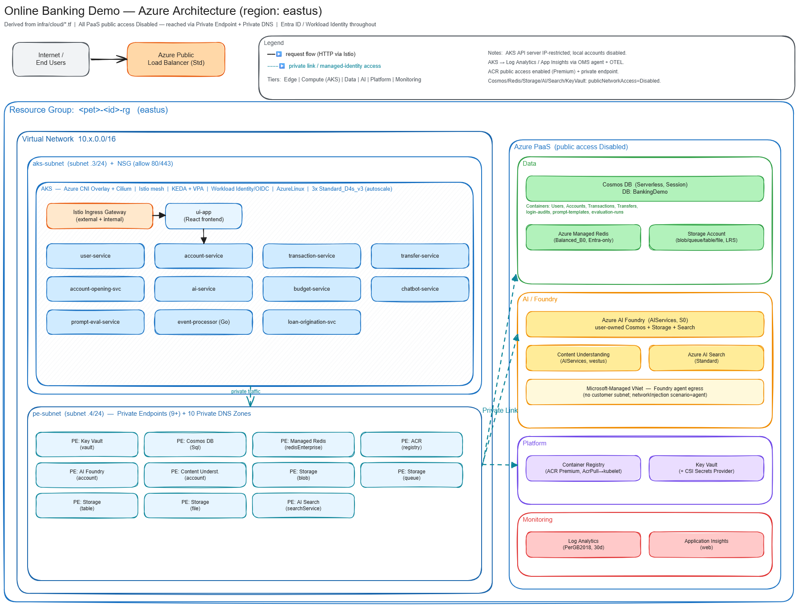

# System Architecture

[← Home](README.md) | [Next: Local Development →](deployment-local.md)

## Overview

The Online Banking Demo is a microservices-based banking platform built on .NET 9, Python 3.11+, Go 1.22+, and React 18, designed to showcase modern cloud-native patterns with agentic AI capabilities. The system follows a distributed architecture with clear separation of concerns, event-driven communication via Redis Streams, and cloud-optimized deployment on Azure AKS with Istio service mesh.

## Service Map

### Core .NET 9 Microservices

| Service | Responsibility | Communication | Dependencies |
|---------|-----------------|----------------|--------------|
| **User Service** | Authentication (JWT tokens), user registration, profile management | REST/HTTP | Cosmos DB, Redis |
| **Account Service** | Account lifecycle management, balance tracking | REST/HTTP | Cosmos DB, Redis |
| **Transaction Service** | Transaction history, event publishing to Redis Streams | REST/HTTP | Cosmos DB, Redis, Account Service |
| **Transfer Service** | Money transfer orchestration, JWT forwarding to downstream | REST/HTTP | Account Service, Transaction Service, Cosmos DB, Redis |

### Python Agent Services

| Service | Responsibility | Communication | Dependencies |
|---------|-----------------|----------------|--------------|
| **Chatbot Service** | AI financial advisor with Agent Framework, account/transaction data tools, Cosmos chat persistence | REST/HTTP (FastAPI) | Azure AI Foundry, Cosmos DB, Account Service, Transaction Service |
| **AI Service** | Risk scoring, transaction categorization via Foundry agents, Redis Stream consumer | REST/HTTP (FastAPI) | Azure AI Foundry, Redis Streams |
| **Budget Service** | Budget analysis, spending insights, financial health scoring | REST/HTTP (FastAPI) | Transaction Service, Azure AI Foundry |
| **Account Opening Service** | AI-powered multi-agent pipeline for new account applications — document extraction (Azure CUS), identity verification, KYC compliance, and account provisioning via Foundry agents | REST/HTTP (FastAPI) + Redis Streams | Azure AI Foundry, Azure Content Understanding, Cosmos DB, Blob Storage, Redis Streams, User Service, Account Service |

### Infrastructure & Admin Services

| Service | Responsibility | Communication | Dependencies |
|---------|-----------------|----------------|--------------|
| **Event Processor** (Go) | Redis Streams consumer, audit routing, event fan-out | Redis Streams | Subscribes to banking-events stream |
| **Prompt Eval Service** (.NET 9) | Prompt template CRUD and admin evaluation orchestration; delegates eval execution to ai-service | REST/HTTP | ai-service (`/api/admin/evaluate`), Cosmos DB |
| **UI Application** (React 18 + MUI v9) | Web frontend, admin panel, chat UI | HTTP, REST | Consumes Istio gateway |
| **Redis** | Event streaming (Redis Streams as event bus) | Redis protocol | Shared by producer/consumer services |

## Communication Patterns

### Synchronous (Request-Response)

- **External clients** → Istio Ingress Gateway (HTTP/HTTPS) → Service via virtual service routing
- **Frontend** → Istio Gateway → Services
- **Service-to-service**: Direct internal HTTP calls with JWT forwarding (e.g., Transfer → Account, Transfer → Transaction)
- **API Documentation**:
  - .NET services: Swagger UI at `/swagger/index.html`, exposed via gateway at `/api/{service}/swagger/index.html`
  - Python/FastAPI services: Swagger UI at `/docs`, OpenAPI JSON at `/openapi.json`
  - Committed OpenAPI specs: `docs/api/{service-name}-openapi.json` (regenerate with `python scripts/generate-openapi.py`)

### Asynchronous (Event-Driven)

- **Redis Streams**: Primary event bus using `banking-events` stream
- **Event publishers**: Transaction Service, Transfer Service, Anomaly Service publish events
- **Event Processor**: Go service that consumes events via consumer groups and routes to downstream processors
- **Consumer groups**: Multiple consumer group patterns for different event handling strategies

## Authentication & Authorization

### JWT Token Flow

```
1. User POST /api/auth/login (email + password)
   └─> User Service validates credentials
   
2. User Service returns JWT token:
   - Issuer: "user-service"
   - Key: Environment variable (JWT_KEY, mapped to Jwt__Key for .NET services)
   - Contains: user_id, email, roles
   
3. Client includes Bearer token in Authorization header:
   Authorization: Bearer <JWT_TOKEN>
   
4. API Gateway passes Authorization header to services
   
5. Each service validates JWT signature using shared key
```

### Protected Endpoints

- `/api/users/*` - User management (requires login)
- `/api/accounts/*` - Account operations (requires login)
- `/api/transactions/*` - Transaction queries (requires login)
- `/api/transfers/*` - Transfer operations (requires login)
- `/api/chat/*` - Chatbot queries (requires login)

## Data Flow & Event Pipeline

### Transaction Flow Example

```
User calls /api/transfers/execute

Transfer Service:
  ├─ Validates request (JWT token)
  ├─ Calls Account Service (get details, lock)
  ├─ Calls Transaction Service (record)
  ├─ Publishes event to banking-events stream
  │   {"event_type": "transfer.completed", ...}
  └─ Returns transfer ID and status

Event Processor (subscribes to banking-events):
  ├─ Routes to audit logger, anomaly detector
  └─ Updates consumer group offset

Anomaly Service:
  ├─ AI Service analyzes transaction patterns
  ├─ Publishes anomaly.detected if suspicious
  └─ Returns risk score

Budget Service:
  ├─ Categorizes spending
  ├─ Updates budget tracking
  └─ Scores financial health
```

### Event Types (banking-events stream)

- **transfer.initiated** - Transfer request received
- **transfer.completed** - Transfer successfully executed
- **transaction.recorded** - Transaction logged in ledger
- **account.locked** - Account locked for processing
- **account.unlocked** - Account released
- **anomaly.detected** - Suspicious activity flagged
- **budget.updated** - Budget changed

### Account Opening Pipeline (Multi-Agent)

The Account Opening Service uses a 4-stage AI agent pipeline orchestrated via Redis Streams:

```
User submits POST /api/applications (with ID document upload)

Stage 1 — Document Extraction (Azure Content Understanding Service):
  ├─ Uploaded document stored in Azure Blob Storage
  ├─ CUS extracts identity data (name, DOB, address, ID number)
  ├─ Publishes document_extracted event to Redis Stream
  └─ Application state updated in Cosmos DB

Stage 2 — Identity Verification (Foundry Agent):
  ├─ Consumes document_extracted event
  ├─ Foundry agent verifies identity against extracted data
  ├─ Publishes identity_verified event
  └─ Updates application state

Stage 3 — Compliance Check / KYC (Foundry Agent):
  ├─ Consumes identity_verified event
  ├─ Foundry agent performs KYC/AML compliance assessment
  ├─ Publishes compliance_checked event
  └─ Updates application state

Stage 4 — Account Provisioning (Foundry Agent):
  ├─ Consumes compliance_checked event
  ├─ Foundry agent makes provisioning decision
  ├─ Calls User Service + Account Service to create user/account
  └─ Application state set to approved/rejected
```

**Deployment model:**
- **API container** (`account-opening-service`) — FastAPI REST API for submitting and querying applications
- **Worker container** (`account-opening-worker`) — Background processor running 4 agent consumers
- **Init container** (`provision-agents`) — Provisions Foundry agents at startup
- **Entra Agent ID auth-sidecar** — Handles Foundry authentication via Microsoft Entra Agent ID (worker only)

### Prompt Evaluation Pipeline (LLM-as-Judge)

The admin "Run Evaluation" feature uses an LLM-as-judge pipeline implemented in `ai-service` (`POST /api/admin/evaluate`):

```
Admin clicks "Run" in UI

prompt-eval-service (.NET):
  ├─ Loads prompt template + transaction samples + selected evaluators
  ├─ Calls ai-service POST /api/admin/evaluate
  └─ Persists returned per-evaluator scores in Cosmos (evaluation-runs)

ai-service (Python):
  ├─ Candidate FoundryAgent runs the prompt against the transaction
  ├─ Judge FoundryAgent scores the candidate's response against each
  │   evaluator on a 1–5 scale, returning a JSON rubric
  ├─ Score ≥ 3 ⇒ passed = true
  └─ Returns { total, passed, failed, all_passed, per_evaluator,
               items[].scores, eval_id, run_id, status }
```

Both the candidate and the judge run on `gpt-5.4-mini` via the standard Foundry agent path inside the Managed VNet. See [ADR-006](adr/006-llm-as-judge-evaluation.md) for why this replaced Foundry's hosted `FoundryEvals`/`raisvc` backend.

**Key files:**
- `src/account-opening-service/app/main.py` — API endpoints
- `src/account-opening-service/app/worker.py` — Worker wiring and consumer loop
- `src/account-opening-service/app/agents/` — Individual agent stage implementations
- `deploy/kustomize/base/account-opening-service.yaml` — Kubernetes manifests

## Deployment Architecture

### Local Development (Docker Compose)

- 4 .NET services (user, account, transaction, transfer)
- 3 Python services (chatbot, anomaly, budget)
- 1 Python account opening pipeline (API + worker containers)
- 1 Go service (event-processor)
- 1 React UI
- 1 NGINX gateway
- 1 Redis instance

**Network**: Docker bridge network (compose auto-networking)
**Storage**: Redis persistence to `redis-data` volume
**Ports**: All services exposed on localhost

### Cloud Deployment (Azure AKS)

```
Azure Resource Group
├─ AKS Cluster (Kubernetes + Istio service mesh)
│  ├─ Namespace: banking-demo
│  ├─ Deployments (all services)
│  ├─ Services (ClusterIP)
│  ├─ Istio Ingress Gateway (HTTP/HTTPS)
│  ├─ ConfigMaps & Secrets (banking-secrets via CSI)
│  ├─ SecretProviderClass (KeyVault CSI driver)
│  └─ Workload Identity (Entra ID)
│
├─ Cosmos DB (Entra RBAC auth, BankingDemo database)
│  ├─ Users, Accounts, Transactions, Transfers, ChatSessions
│
├─ Azure Managed Redis (Balanced B0, port 10000/TLS, Entra auth)
├─ Azure Container Registry (ACR, Premium SKU)
├─ Azure AI Foundry (OpenAI models + agents)
├─ Application Insights (OTEL SDK)
├─ Key Vault (secrets synced to K8s via CSI driver)
├─ Log Analytics Workspace (diagnostics)
├─ VNet (/16) with 3 subnets:
│  ├─ AKS subnet (/24, offset 3)
│  ├─ Private Endpoints subnet (/24, offset 4)
│  └─ Agents subnet (/24, offset 5, Microsoft.App/environments delegation)
├─ 9 Private Endpoints (Key Vault, Cosmos DB, Redis, ACR, AI Services, Storage ×4)
└─ 10 Private DNS Zones (name resolution for all private endpoints)
```

**Deployment**: Taskfile-driven (`task cloud:up`, `task cloud:build`, `task cloud:deploy`)

### Azure Infrastructure Diagram

The diagram below shows the full Azure topology — edge routing, the AKS workloads, the private-endpoint network boundary, and the PaaS/AI services. All PaaS services have public access disabled and are reached via Private Endpoints + Private DNS, with Entra ID / Workload Identity used throughout.



> Editable source: [`diagrams/azure-architecture.excalidraw`](diagrams/azure-architecture.excalidraw) — open at [excalidraw.com](https://excalidraw.com) or with the VS Code Excalidraw extension.

## Scaling Considerations

### Horizontal Scaling

- **Stateless services**: Scale replicas in K8s based on CPU/memory metrics
- **Redis**: Switch to Azure Cache for Redis in production
- **Database**: Cosmos DB handles scaling automatically

### Optimization

1. **API Gateway** - NGINX can handle ~1000 req/s; use K8s HPA to scale
2. **Transaction Service** - Cache frequently accessed transactions in Redis
3. **Event Processing** - Use consumer groups for parallel processing
4. **Authentication** - Cache JWT validation results in-memory

## Security Architecture

### Network Security

- **Istio service mesh** manages traffic routing, mTLS between pods
- **Services isolated** within K8s network namespace in production
- **Istio Ingress Gateway** handles all external traffic (HTTP/HTTPS)
- **Service-to-service** calls use internal K8s DNS names with JWT forwarding
- **Private endpoints** for all PaaS services — traffic stays on the Azure backbone (public access disabled except ACR)
- **10 private DNS zones** for name resolution: Key Vault, Cosmos DB, Redis, ACR, Cognitive Services, OpenAI, Storage (blob, queue, table, file)
- **Agent subnet** with `Microsoft.App/environments` delegation for AI Foundry agent compute

### Data Security

- **In-transit**: TLS/SSL for all external communication, cert-manager + Let's Encrypt for HTTPS
- **At-rest**: Cosmos DB encryption, Redis TLS (port 10000) in production
- **Secrets**: Key Vault CSI driver syncs secrets to K8s (SecretProviderClass)

### Identity & Access

- **JWT tokens** for API authentication (HS256, shared key)
- **Workload Identity** for Azure resource access (Cosmos DB, Redis, AI Foundry)
- **Entra RBAC** for Cosmos DB and Redis (no connection string keys)
- **Entra Agent ID sidecar** for Account Opening Service — authenticates Foundry agent calls via Microsoft Entra Agent ID
- **RBAC**: Namespace isolation (banking-demo separate from system)

## Monitoring & Observability

### Logging

- **Application Insights**: Instrumented via OTEL SDK + `APPLICATIONINSIGHTS_CONNECTION_STRING`
- **Local dev**: Logs to stdout/stderr (captured by Docker)

### Metrics

- **Request metrics**: Count, latency, error rate per endpoint
- **System metrics**: CPU, memory, disk I/O
- **Business metrics**: Transaction volume, anomaly rate

### Tracing

- **Distributed tracing**: Trace IDs across service calls
- **Service dependency map**: Generated from trace data
- **Error tracking**: Exceptions logged with full context

## Resilience Patterns

### Retry Logic

- **Transient failures**: Exponential backoff (2s, 4s, 8s, etc.)
- **Circuit breaker**: Break circuit after 5 failures in 30s

### Fallback

- **Account Service unavailable**: Return HTTP 503
- **Redis unavailable**: Continue but disable event publishing

### Health Checks

- **Liveness probe**: Kubernetes restarts unhealthy pods
- **Readiness probe**: Removes unhealthy pods from load balancer
- **Startup probe**: Grace period for initialization (30s)

---

**Last Updated**: May 2026  
**Architecture Version**: 3.0

---

[← Home](README.md) | [Next: Local Development →](deployment-local.md)
